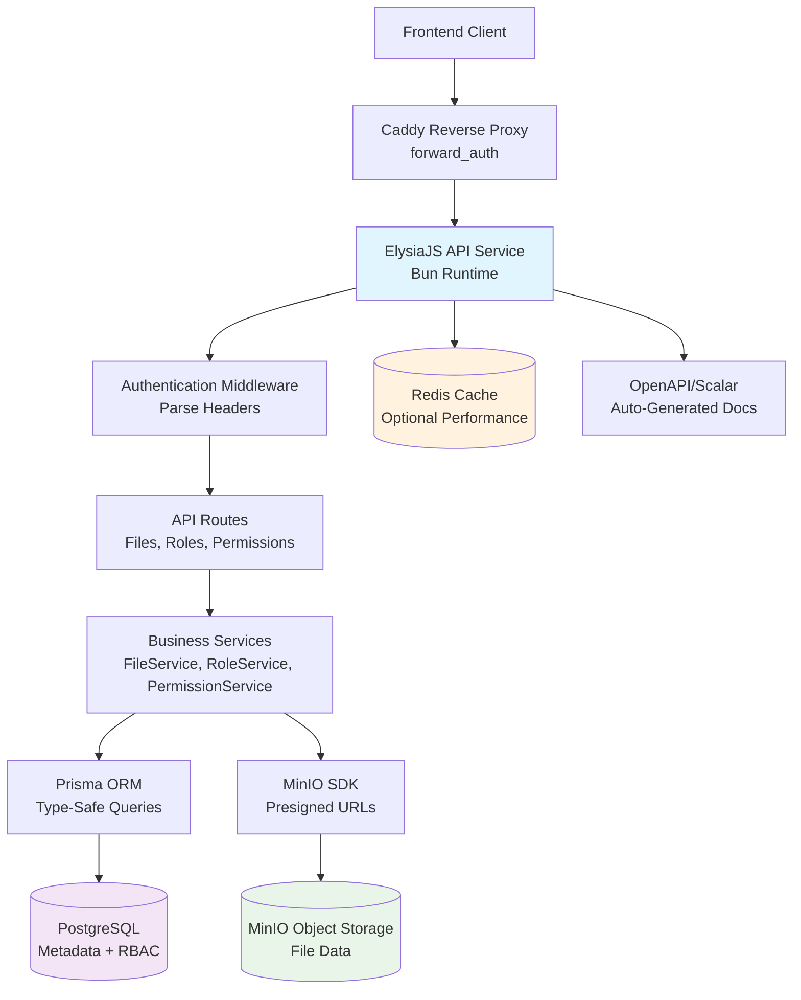
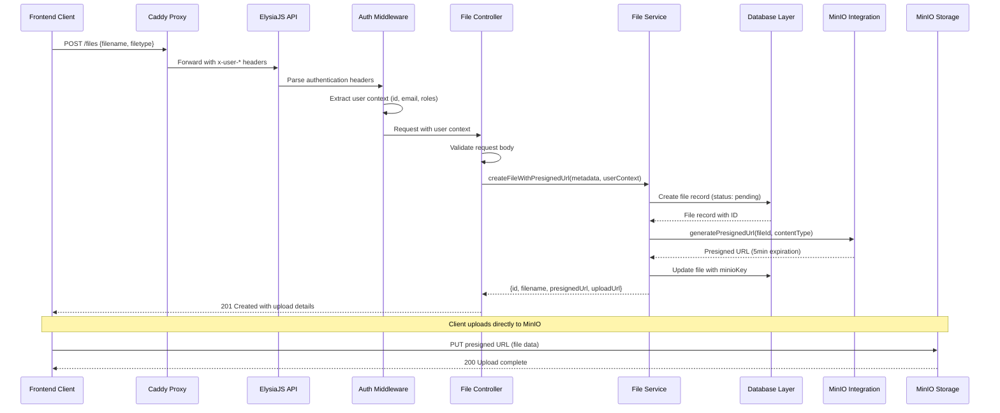

-----

### เอกสารสถาปัตยกรรม MinIO Admin Backend (MVP)

เอกสารฉบับนี้สรุปภาพรวมสถาปัตยกรรมของโครงการ **MinIO Admin Backend (MVP)** (Minimum Viable Product) โดยครอบคลุมระบบฝั่งแบ็กเอนด์, บริการที่ใช้ร่วมกัน, และประเด็นอื่น ๆ ที่ไม่ได้เกี่ยวข้องกับส่วนติดต่อผู้ใช้ (UI) โดยตรง เป้าหมายหลักคือการใช้เอกสารนี้เป็นพิมพ์เขียวสำหรับงานพัฒนาที่ขับเคลื่อนด้วย AI เพื่อให้แน่ใจว่าการพัฒนาจะเป็นไปอย่างสอดคล้องกันตามรูปแบบและเทคโนโลยีที่กำหนดไว้

**ความสัมพันธ์กับสถาปัตยกรรมส่วนหน้า (Frontend):** โครงการนี้เป็นเพียงบริการ API ฝั่งแบ็กเอนด์เท่านั้น จึงไม่จำเป็นต้องมีเอกสารสถาปัตยกรรมสำหรับส่วนหน้าโดยเฉพาะ การเลือกเทคโนโลยีหลักในเอกสารนี้ถือเป็นข้อสรุปสำหรับโครงการทั้งหมด

-----

#### เทมเพลตเริ่มต้นหรือโครงการที่มีอยู่แล้ว

**ข้อสรุป:** N/A - โครงการใหม่ทั้งหมด (Greenfield) ที่ใช้การตั้งค่า ElysiaJS + Bun แบบกำหนดเอง เพื่อให้รองรับการทำงานร่วมกับ MinIO และข้อกำหนดด้านการควบคุมการเข้าถึงตามบทบาท (RBAC) โดยเฉพาะ

-----

#### ประวัติการเปลี่ยนแปลง (Change Log)

|วันที่|เวอร์ชัน|คำอธิบาย|ผู้เขียน|
|---|---|---|---|
|2024-12-19|1.0|การออกแบบสถาปัตยกรรมเบื้องต้นจากเอกสารข้อกำหนดผลิตภัณฑ์ (PRD)|Architect Winston|

-----

### ภาพรวมสถาปัตยกรรมระดับสูง

#### สรุปเชิงเทคนิค

MinIO Admin Backend MVP ใช้สถาปัตยกรรม **REST API แบบ Monolithic** ซึ่งสร้างด้วย **Bun runtime** และ **ElysiaJS framework** เพื่อรองรับการควบคุมการเข้าถึงตามบทบาท (RBAC) สำหรับการจัดเก็บไฟล์ใน MinIO ระบบนี้ใช้ **แนวทาง "ฐานข้อมูลนำ" (database-first)** โดย PostgreSQL จะทำหน้าที่เก็บข้อมูลเมตาของไฟล์และความสัมพันธ์ของ RBAC ในขณะที่ MinIO จะจัดการการจัดเก็บไฟล์จริง ๆ การออกแบบยึดหลัก **"ความปลอดภัยต้องมาก่อน" (security-first)** ทำให้ค่าเริ่มต้นเป็นแบบจำกัดสิทธิ์และต้องมีการให้สิทธิ์อย่างชัดเจน โดยผนวกเข้ากับโครงสร้างพื้นฐานเดิมของ **Caddy reverse proxy forward\_auth** ได้อย่างราบรื่น สถาปัตยกรรมนี้รองรับการ **พัฒนาอย่างรวดเร็วโดยนักศึกษาฝึกงานหนึ่งคน** ในขณะเดียวกันก็รักษา **มาตรฐานพร้อมใช้งานสำหรับ Production** ผ่านการจัดการข้อผิดพลาด, การตรวจสอบข้อมูลขาเข้า, และการสร้างเอกสาร API โดยอัตโนมัติ

-----

#### ภาพรวมระดับสูง

**รูปแบบสถาปัตยกรรมหลัก:** **RESTful API Monolith** - บริการเดี่ยวที่มีการแบ่งโมดูลภายในอย่างชัดเจน เพื่อให้พัฒนาได้รวดเร็วและบำรุงรักษาง่าย

**โครงสร้าง Repository:** **Monorepo** - โค้ดทั้งหมดอยู่ใน Repository เดียวกัน โดยมีการจัดระเบียบโครงสร้างไดเรกทอรี `src/` อย่างเป็นระบบ เพื่อให้สอดคล้องกับกรอบเวลาการพัฒนาของนักศึกษาฝึกงาน 4 สัปดาห์

**สถาปัตยกรรมบริการ:** **Monolithic Service** - แอปพลิเคชัน ElysiaJS ตัวเดียวที่มีการจัดระเบียบภายในแบบโมดูลาร์ (routes, services, middleware) ซึ่งเหมาะสำหรับนักพัฒนาที่เพิ่งเริ่มต้น แต่ยังคงรักษามาตรฐานแบบมืออาชีพไว้

**ขั้นตอนการทำงานของสถาปัตยกรรมหลัก:**

1.  **คำขอจากลูกค้า (Client Request)** → Caddy Reverse Proxy (forward\_auth) → **API Gateway** (ElysiaJS)
2.  **มิดเดิลแวร์ยืนยันตัวตน (Authentication Middleware)** → แยกบทบาทผู้ใช้จากส่วนหัว (headers) → **บริการประมวลผลทางธุรกิจ (Business Logic Services)**
3.  **การทำงานกับฐานข้อมูล (Database Operations)** → Prisma ORM → **PostgreSQL** (ข้อมูลเมตา + RBAC)
4.  **การทำงานกับไฟล์ (File Operations)** → MinIO SDK → **MinIO Object Storage** (ไฟล์จริง)
5.  **การตอบกลับ (Response)** → การตอบกลับ API แบบ JSON พร้อมการจัดการข้อผิดพลาดที่เหมาะสม

**จุดเชื่อมต่อที่สำคัญ:**

  * **Caddy Forward Auth:** ระบุตัวตนผู้ใช้ผ่านส่วนหัว `x-user-id`, `x-user-email`, `x-user-roles`
  * **PostgreSQL Database:** ใช้สำหรับข้อมูลเมตาของไฟล์, บทบาท (roles), และความสัมพันธ์ของสิทธิ์ (permissions)
  * **MinIO Object Storage:** ใช้สำหรับ URL ที่ลงชื่อล่วงหน้า (Presigned URLs) และการจัดเก็บไฟล์
  * **Redis Cache:** ตัวเลือกเสริมสำหรับเพิ่มประสิทธิภาพการค้นหาข้อมูลเมตา

-----

#### ไดอะแกรมโครงการระดับสูง



-----

#### รูปแบบสถาปัตยกรรม (Architectural Patterns)

  * **Repository Pattern:** แยกส่วนการเข้าถึงข้อมูลสำหรับ Files, Roles, และ FileRolePermissions - *เหตุผล:* ทำให้สามารถทดสอบด้วยข้อมูลจำลอง (mocked data) ได้ง่ายขึ้น และรองรับความยืดหยุ่นของฐานข้อมูลในอนาคต พร้อมทั้งรักษาความปลอดภัยด้านประเภทข้อมูลผ่าน Prisma
  * **Middleware Pipeline Pattern:** การประมวลผลคำขอแบบหลายชั้นสำหรับการยืนยันตัวตน, การตรวจสอบความถูกต้อง, และการให้สิทธิ์ - *เหตุผล:* แยกประเด็นร่วม (cross-cutting concerns) ออกจากส่วนตรรกะทางธุรกิจ ซึ่งเป็นสิ่งสำคัญสำหรับการนำ RBAC มาใช้โดยเน้นความปลอดภัยเป็นหลัก
  * **Service Layer Pattern:** ห่อหุ้มตรรกะทางธุรกิจไว้ในคลาสบริการเฉพาะ (FileService, RoleService, PermissionService) - *เหตุผล:* ส่งเสริมการใช้โค้ดซ้ำและทำให้ทดสอบได้ง่ายขึ้น ในขณะเดียวกันก็ทำให้ตัวจัดการเส้นทาง (route handlers) มีขนาดเล็กและเน้นเฉพาะหน้าที่ที่รับผิดชอบ
  * **Security-First Permission Model:** ใช้ค่าเริ่มต้นแบบจำกัดสิทธิ์และต้องให้สิทธิ์อย่างชัดเจนผ่านตารางเชื่อมโยง (junction table) - *เหตุผล:* ป้องกันการเปิดเผยข้อมูลโดยไม่ตั้งใจและสอดคล้องกับมาตรฐานความปลอดภัยระดับองค์กร ในขณะที่ยังคงง่ายสำหรับนักศึกษาฝึกงานที่จะนำไปใช้งาน
  * **Database-First Architecture:** การทำงานกับไฟล์ทั้งหมดจะเริ่มต้นจากการตรวจสอบข้อมูลเมตาใน PostgreSQL ก่อนที่จะเข้าถึง MinIO - *เหตุผล:* ช่วยให้สามารถสร้างการค้นหา RBAC ที่ซับซ้อน, ตรวจสอบประวัติการเข้าถึง (audit trails), และจัดการสถานะได้อย่างสอดคล้องกัน ซึ่งเป็นสิ่งจำเป็นสำหรับระบบจัดการไฟล์ในระดับ Production
  * **External Service Integration Pattern:** ใช้ส่วนหัว Caddy forward\_auth สำหรับการยืนยันตัวตน และ MinIO SDK สำหรับการจัดเก็บไฟล์ - *เหตุผล:* ใช้ประโยชน์จากโครงสร้างพื้นฐานที่มีอยู่เดิม ในขณะที่ยังคงแยกส่วนความรับผิดชอบอย่างชัดเจนและลดความซับซ้อนในการใช้งาน

-----

### ชุดเทคโนโลยี (Tech Stack)

#### โครงสร้างพื้นฐานบนคลาวด์

**ผู้ให้บริการ:** Self-Hosted / ไม่ขึ้นกับผู้ให้บริการคลาวด์รายใด (Cloud-Agnostic)
**บริการหลัก:** Docker containers พร้อมบริการ PostgreSQL, Redis, และ MinIO
**ภูมิภาคที่ติดตั้ง:** กำหนดโดยผู้ใช้ (รองรับสภาพแวดล้อมที่รองรับ Docker ทุกประเภท)

-----

#### ตารางชุดเทคโนโลยี

|ประเภท|เทคโนโลยี|เวอร์ชัน|วัตถุประสงค์|เหตุผล|
|---|---|---|---|---|
|**Runtime**|Bun|1.0.21+|JavaScript/TypeScript runtime|ประสิทธิภาพดีเยี่ยมสำหรับ ElysiaJS, รองรับ TypeScript ในตัว, เริ่มทำงานได้รวดเร็ว|
|**ภาษา**|TypeScript|5.3+|ภาษาหลักในการพัฒนา|ความปลอดภัยด้านประเภทข้อมูล (Type safety) สำคัญสำหรับตรรกะ RBAC, เครื่องมือดีเยี่ยม, เป็นมิตรกับนักศึกษาฝึกงาน|
|**API Framework**|ElysiaJS|0.8+|เฟรมเวิร์กสำหรับ REST API|สร้าง OpenAPI โดยอัตโนมัติ, ผสานรวมกับ Bun ได้อย่างดีเยี่ยม, มีขนาดเล็กและรวดเร็ว|
|**ฐานข้อมูล**|PostgreSQL|15+|ที่จัดเก็บข้อมูลหลัก|รองรับ ACID เพื่อความสมบูรณ์ของ RBAC, รองรับ Prisma ได้ดีเยี่ยม, มีระบบนิเวศที่เติบโตเต็มที่|
|**ORM**|Prisma|5.7+|การทำงานกับฐานข้อมูล|การค้นหาที่ปลอดภัยด้านประเภทข้อมูล, การย้ายข้อมูล (migrations) อัตโนมัติ, ผสานรวมกับ TypeScript ได้อย่างดีเยี่ยม|
|**แคช**|Redis|7.2+|ชั้นแคชเสริม|เพิ่มประสิทธิภาพการค้นหาข้อมูลเมตา, ใช้เก็บข้อมูลเซสชันหากจำเป็น|
|**Object Storage**|MinIO|RELEASE.2024-01-01+|ที่จัดเก็บไฟล์|API ที่เข้ากันได้กับ S3, สามารถติดตั้งได้เอง, รองรับ SDK ได้ดีเยี่ยม|
|**Container Runtime**|Docker|24.0+|การติดตั้งแอปพลิเคชัน|การติดตั้งที่สม่ำเสมอ, ตั้งค่าสภาพแวดล้อมการพัฒนาได้ง่าย|
|**Testing Framework**|Bun Test|ในตัว|การทดสอบยูนิต (Unit testing)|ผสานรวมกับ Bun ในตัว, ทำงานได้รวดเร็ว, รองรับ TypeScript|
|**เอกสาร**|Scalar|ใน ElysiaJS|เอกสาร API|สร้างจาก OpenAPI spec โดยอัตโนมัติ, มีหน้าจอสำหรับทดสอบแบบโต้ตอบ|
|**การตรวจสอบ**|ElysiaJS Schema|ในตัว|การตรวจสอบคำขอ/การตอบกลับ|การตรวจสอบที่ปลอดภัยด้านประเภทข้อมูล, สร้าง OpenAPI โดยอัตโนมัติ|
|**การตั้งค่าสภาพแวดล้อม**|dotenv|16.3+|การจัดการการตั้งค่า|โหลดตัวแปรสภาพแวดล้อม, แยกส่วนสำหรับพัฒนาและ Production|
|**การบันทึก**|Pino|8.17+|การบันทึกแบบมีโครงสร้าง|ประสิทธิภาพสูง, บันทึกในรูปแบบ JSON ที่มีโครงสร้าง, พร้อมใช้งานสำหรับ Production|
|**Linting & Formatting**|Biome.js|1.4+|คุณภาพและรูปแบบโค้ด|เครื่องมือเดียวสำหรับทั้ง linting และ formatting, ทำงานเร็วกว่า ESLint+Prettier|

-----

### แบบจำลองข้อมูล (Data Models)

#### File

**วัตถุประสงค์:** แสดงข้อมูลเมตาของไฟล์และการอ้างอิงพื้นที่จัดเก็บ MinIO สำหรับไฟล์ทั้งหมดที่อัปโหลดเข้าสู่ระบบ

**คุณสมบัติหลัก:**

  * `id`: UUID - ตัวระบุเฉพาะสำหรับการทำงานกับฐานข้อมูลและการอ้างอิง API
  * `filename`: String - ชื่อไฟล์ที่ผู้ใช้กำหนด พร้อมการตรวจสอบอักขระที่ปลอดภัย
  * `filetype`: String - ประเภท MIME สำหรับการตรวจสอบเนื้อหาและการสร้าง URL ที่ลงชื่อล่วงหน้า
  * `fileSize`: BigInt - ขนาดไฟล์เป็นไบต์สำหรับการติดตามการใช้งานพื้นที่และตรวจสอบความถูกต้อง
  * `uploadedAt`: DateTime - Timestamp สำหรับตรวจสอบประวัติและเรียงลำดับตามเวลา
  * `minioKey`: String - Key ของอ็อบเจกต์ใน MinIO สำหรับการทำงานกับพื้นที่จัดเก็บและการล้างข้อมูล
  * `uploadStatus`: Enum - ติดตามสถานะการอัปโหลด (pending, completed, failed)

**ความสัมพันธ์:**

  * One-to-Many กับ FileRolePermissions (ไฟล์หนึ่งไฟล์สามารถมีสิทธิ์สำหรับหลายบทบาท)
  * ถูกอ้างอิงโดยการทำงานของ MinIO ผ่านฟิลด์ `minioKey`

<!-- end list -->

```typescript
interface File {
    id: string;
    filename: string;
    filetype: string;
    fileSize: bigint;
    uploadedAt: Date;
    minioKey: string;
    uploadStatus: 'pending' | 'completed' | 'failed';
    permissions: FileRolePermission[];
}
```

-----

#### Role

**วัตถุประสงค์:** กำหนดกลุ่มสิทธิ์ (permission groups) ที่มีชื่อ ซึ่งสามารถกำหนดให้กับผู้ใช้และให้สิทธิ์การเข้าถึงไฟล์เฉพาะเจาะจงได้

**คุณสมบัติหลัก:**

  * `id`: UUID - ตัวระบุเฉพาะสำหรับการจัดการบทบาท
  * `name`: String - ชื่อบทบาทที่อ่านเข้าใจง่ายสำหรับมนุษย์ (ต้องไม่ซ้ำกัน)
  * `createdAt`: DateTime - ประวัติการสร้างบทบาท
  * `updatedAt`: DateTime - ติดตามการแก้ไขบทบาท

**ความสัมพันธ์:**

  * One-to-Many กับ FileRolePermissions (หนึ่งบทบาทสามารถเข้าถึงได้หลายไฟล์)
  * ถูกอ้างอิงโดย Caddy header parsing (ส่วนหัว `x-user-roles` จะมีชื่อบทบาท)

<!-- end list -->

```typescript
interface Role {
    id: string;
    name: string;
    createdAt: Date;
    updatedAt: Date;
    filePermissions: FileRolePermission[];
}
```

-----

#### FileRolePermission

**วัตถุประสงค์:** ตารางเชื่อมโยง (junction table) ที่ใช้สร้างความสัมพันธ์แบบ Many-to-Many ระหว่าง Files และ Roles เพื่อให้สามารถควบคุมการเข้าถึงได้อย่างละเอียด

**คุณสมบัติหลัก:**

  * `fileId`: UUID - Foreign key อ้างอิงไปยังตาราง Files
  * `roleName`: String - Foreign key อ้างอิงไปยัง `Roles.name` (ไม่ใช่ ID เพื่อให้เข้ากันได้กับส่วนหัว Caddy)
  * `grantedAt`: DateTime - ประวัติการให้สิทธิ์
  * `grantedBy`: String - ID ผู้ใช้ที่ให้สิทธิ์ (จากส่วนหัว `x-user-id`)

**ความสัมพันธ์:**

  * Many-to-One กับ File (สิทธิ์หนึ่งสิทธิ์เป็นของไฟล์ที่เฉพาะเจาะจง)
  * Many-to-One กับ Role (สิทธิ์หนึ่งสิทธิ์ให้สิทธิ์การเข้าถึงแก่บทบาทที่เฉพาะเจาะจง)

<!-- end list -->

```typescript
interface FileRolePermission {
    fileId: string;
    roleName: string;
    grantedAt: Date;
    grantedBy: string;
    file: File;
    role: Role;
}
```

-----

### ส่วนประกอบ (Components)

#### Authentication Middleware

**หน้าที่:** แยกวิเคราะห์และตรวจสอบส่วนหัว `Caddy forward_auth`, ดึงบริบทของผู้ใช้ (user context) สำหรับปลายทาง API ที่มีการป้องกันทั้งหมด

**อินเทอร์เฟซหลัก:**

  * `parseAuthHeaders(request): UserContext` - ดึง User ID, อีเมล, และบทบาทจากส่วนหัว
  * `validateUserContext(context): boolean` - ตรวจสอบความถูกต้องของข้อมูลการยืนยันตัวตนที่จำเป็น
  * `attachUserToRequest(request, context)` - ทำให้ข้อมูลผู้ใช้พร้อมใช้งานสำหรับตัวจัดการเส้นทาง

**การพึ่งพิง:** ระบบมิดเดิลแวร์ของ ElysiaJS, เครื่องมือสำหรับตรวจสอบส่วนหัว

**ชุดเทคโนโลยี:** TypeScript interfaces สำหรับบริบทผู้ใช้, ElysiaJS middleware hooks, ตรรกะการตรวจสอบแบบกำหนดเอง

-----

#### File Service

**หน้าที่:** จัดการไฟล์หลัก รวมถึงการสร้าง, อ่าน, อัปเดต, ลบ (CRUD) ข้อมูลเมตา, การผสานรวมกับ MinIO, และการจัดการวงจรชีวิตของไฟล์

**อินเทอร์เฟซหลัก:**

  * `createFileRecord(metadata): FileRecord` - สร้างเรคคอร์ดในฐานข้อมูลพร้อมการตรวจสอบ
  * `generatePresignedUrl(fileId): PresignedUrlResponse` - สร้าง URL ที่ลงชื่อล่วงหน้าของ MinIO
  * `listFiles(pagination, search, userRoles): PaginatedFileList` - แสดงรายการไฟล์โดยกรองตามบทบาท
  * `updateFileMetadata(fileId, updates): FileRecord` - แก้ไขข้อมูลเมตาของไฟล์
  * `deleteFile(fileId): boolean` - ล้างทั้งข้อมูลในฐานข้อมูลและพื้นที่จัดเก็บ MinIO

**การพึ่งพิง:** Prisma client, MinIO SDK, Permission Service สำหรับการควบคุมการเข้าถึง

**ชุดเทคโนโลยี:** Prisma models, การตั้งค่า MinIO client, TypeScript service classes

-----

#### Role Service

**หน้าที่:** การจัดการบทบาท รวมถึงการสร้าง, อ่าน, อัปเดต, ลบ (CRUD) การบังคับใช้การสร้างบทบาทเฉพาะสำหรับ "Boss" และการตรวจสอบบทบาท

**อินเทอร์เฟซหลัก:**

  * `createRole(name, creatorRoles): Role` - สร้างบทบาทพร้อมตรวจสอบสิทธิ์ "Boss"
  * `listRoles(): Role[]` - ดึงบทบาททั้งหมดที่มี
  * `updateRole(roleId, updates): Role` - แก้ไขคุณสมบัติบทบาทพร้อมการตรวจสอบ
  * `deleteRole(roleId): boolean` - ลบบทบาทและล้างสิทธิ์ที่เกี่ยวข้องทั้งหมด
  * `validateRoleExists(roleName): boolean` - ตรวจสอบว่าบทบาทมีอยู่จริงสำหรับการทำงานกับสิทธิ์

**การพึ่งพิง:** Prisma client, Authentication Middleware สำหรับบริบทผู้ใช้

**ชุดเทคโนโลยี:** Prisma role model, ตรรกะการตรวจสอบแบบกำหนดเอง, TypeScript role interfaces

-----

#### Permission Service

**หน้าที่:** การจัดการสิทธิ์ของไฟล์ รวมถึงการให้/ยกเลิกสิทธิ์อย่างชัดเจน, การตรวจสอบสิทธิ์การเข้าถึง, และการสืบค้นข้อมูลสำหรับผู้ดูแล

**อินเทอร์เฟซหลัก:**

  * `grantFileAccess(fileId, roleName, grantedBy): FileRolePermission` - ให้สิทธิ์อย่างชัดเจน
  * `revokeFileAccess(fileId, roleName): boolean` - ลบสิทธิ์การเข้าถึงไฟล์สำหรับบทบาทที่กำหนด
  * `checkFileAccess(fileId, userRoles): boolean` - ตรวจสอบว่าผู้ใช้สามารถเข้าถึงไฟล์ได้หรือไม่
  * `listFilePermissions(fileId): FileRolePermission[]` - ดึงสิทธิ์ทั้งหมดสำหรับไฟล์
  * `listRoleFiles(roleName): File[]` - การสืบค้นสำหรับผู้ดูแลเพื่อดูไฟล์ที่บทบาทนั้นเข้าถึงได้

**การพึ่งพิง:** Prisma client, Role Service, File Service สำหรับการตรวจสอบ

**ชุดเทคโนโลยี:** การทำงานกับตารางเชื่อมโยง, การสืบค้น Prisma ที่ซับซ้อน, ตรรกะการตรวจสอบสิทธิ์

-----

#### ส่วนประกอบสถาปัตยกรรมผู้ให้บริการ (Provider Architecture Components)

**Database Provider:**

  * การเริ่มต้นใช้งานและการจัดการการเชื่อมต่อ Prisma client
  * การตรวจสอบสถานะฐานข้อมูลและตรรกะการเชื่อมต่อใหม่
  * เครื่องมือการจัดการธุรกรรม (transaction)
  * การตรวจสอบประสิทธิภาพการสืบค้น

**MinIO Provider:**

  * การตั้งค่าและกำหนดค่า MinIO client
  * การสร้าง URL ที่ลงชื่อล่วงหน้า
  * การทำงานกับการอัปโหลด/ดาวน์โหลดไฟล์
  * การตรวจสอบสถานะพื้นที่จัดเก็บและการจัดการข้อผิดพลาด

**Redis Provider:**

  * การเชื่อมต่อและกำหนดค่า Redis client
  * การทำงานกับแคชและการจัดการ TTL
  * การตรวจสอบสถานะแคชและการสลับการทำงาน
  * เครื่องมือการจัดเก็บเซสชัน (หากจำเป็น)

-----

### API ภายนอก (External APIs)

#### MinIO Object Storage API

**วัตถุประสงค์:** API สำหรับพื้นที่จัดเก็บไฟล์ที่เข้ากันได้กับ S3 สำหรับการอัปโหลด/ดาวน์โหลดไฟล์และการสร้าง URL ที่ลงชื่อล่วงหน้า

**เอกสาร:** [https://min.io/docs/minio/linux/developers/javascript/API.html](https://min.io/docs/minio/linux/developers/javascript/API.html)
**Base URL(s):** ผู้ใช้กำหนดผ่านตัวแปรสภาพแวดล้อม `MINIO_ENDPOINT` (เช่น `http://localhost:9000`)
**การยืนยันตัวตน:** Access Key + Secret Key ผ่านตัวแปรสภาพแวดล้อม `MINIO_ACCESS_KEY` และ `MINIO_SECRET_KEY`
**ข้อจำกัดอัตรา (Rate Limits):** ไม่มีข้อจำกัดที่กำหนดไว้ชัดเจน ขึ้นอยู่กับการตั้งค่าเซิร์ฟเวอร์ MinIO และความจุของเครือข่าย

**ปลายทางที่ใช้งานหลัก:**

  * `PUT /bucket/object-key` - อัปโหลดไฟล์ผ่าน URL ที่ลงชื่อล่วงหน้า (หมดอายุใน 5 นาที)
  * `DELETE /bucket/object-key` - ลบไฟล์ระหว่างการล้างข้อมูล
  * `HEAD /bucket/object-key` - ตรวจสอบการมีอยู่ของไฟล์และข้อมูลเมตา

**หมายเหตุการผสานรวม:**

  * ใช้ MinIO JavaScript SDK อย่างเป็นทางการสำหรับการทำงานที่ปลอดภัยด้านประเภทข้อมูล
  * URL ที่ลงชื่อล่วงหน้าสร้างขึ้นที่ฝั่งเซิร์ฟเวอร์ และใช้ที่ฝั่งไคลเอนต์สำหรับการอัปโหลดโดยตรง
  * การจัดการข้อผิดพลาดครอบคลุมถึงกรณีที่บริการ MinIO ไม่พร้อมใช้งาน (HTTP 500 responses)
  * การรวมกลุ่มการเชื่อมต่อ (connection pooling) จัดการโดย SDK พร้อมการตั้งค่า timeout ที่กำหนดได้
  * ชื่อ Bucket กำหนดผ่านตัวแปรสภาพแวดล้อม `MINIO_BUCKET_NAME`

-----

#### Caddy Forward Auth Headers

**วัตถุประสงค์:** ข้อมูลการยืนยันตัวตนผู้ใช้และข้อมูลบทบาทที่จัดเตรียมผ่านส่วนหัว HTTP จาก Caddy reverse proxy

**รูปแบบการผสานรวม:** การแยกวิเคราะห์ส่วนหัว (Header parsing) ไม่ใช่การเรียก API

  * `x-user-id`: ตัวระบุผู้ใช้ที่ไม่ซ้ำกันจากระบบยืนยันตัวตน
  * `x-user-email`: ที่อยู่อีเมลของผู้ใช้สำหรับตรวจสอบประวัติ
  * `x-user-roles`: ชื่อบทบาทที่คั่นด้วยเครื่องหมายจุลภาคสำหรับการบังคับใช้ RBAC

**หมายเหตุการผสานรวม:**

  * ไม่จำเป็นต้องมีการเรียก API ขาออก - ข้อมูลถูกส่งมาในส่วนหัวของคำขอ
  * ส่วนหัวที่ขาดหายไปจะส่งผลให้เกิดข้อผิดพลาดในการยืนยันตัวตน HTTP 401
  * ส่วนหัวที่รูปแบบไม่ถูกต้องจะส่งผลให้เกิดข้อผิดพลาดในการตรวจสอบ HTTP 400
  * ชื่อบทบาทจะถูกแยกวิเคราะห์เป็นรูปแบบอาร์เรย์เพื่อใช้ในการตรวจสอบสิทธิ์

-----

### ขั้นตอนการทำงานหลัก (Core Workflows)

#### ขั้นตอนการอัปโหลดไฟล์



-----

### ข้อมูลจำเพาะของ REST API

ข้อมูลจำเพาะ OpenAPI 3.0 ฉบับเต็มพร้อมปลายทางทั้งหมด:

**การยืนยันตัวตน:** Caddy forward\_auth headers (`x-user-id`, `x-user-email`, `x-user-roles`)

**ปลายทางหลัก:**

  * `GET /health` - ตรวจสอบสถานะบริการ
  * `GET /files` - แสดงรายการไฟล์พร้อมการแบ่งหน้าและกรองตามบทบาท
  * `POST /files` - สร้างเรคคอร์ดไฟล์และรับ URL ที่ลงชื่อล่วงหน้า
  * `GET /files/{id}` - ดึงไฟล์ด้วย ID (การเข้าถึงตามบทบาท)
  * `PATCH /files/{id}` - อัปเดตข้อมูลเมตาของไฟล์
  * `DELETE /files/{id}` - ลบไฟล์และอ็อบเจกต์ใน MinIO
  * `POST /files/{id}/permissions` - ให้สิทธิ์การเข้าถึงไฟล์แก่บทบาท
  * `DELETE /files/{id}/permissions/{role}` - ยกเลิกสิทธิ์การเข้าถึงของบทบาท
  * `GET /roles` - แสดงรายการบทบาททั้งหมด
  * `POST /roles` - สร้างบทบาท (เฉพาะ Boss)
  * `PUT /roles/{id}` - อัปเดตบทบาท
  * `DELETE /roles/{id}` - ลบบทบาท

**ปลายทางสำหรับผู้ดูแล (Admin Endpoints)** (ต้องมีบทบาท Boss):

  * `GET /roles/{role}/files` - แสดงรายการไฟล์ที่บทบาทเข้าถึงได้
  * `GET /files/by-role` - กรองไฟล์ตามบทบาท

ปลายทางทั้งหมดมี schema ของคำขอ/การตอบกลับ, การจัดการข้อผิดพลาด, และข้อกำหนดการยืนยันตัวตนที่ครบถ้วน

-----

### สกีมาฐานข้อมูล (Database Schema)

#### คำนิยาม Prisma Schema

```prisma
generator client {
    provider = "prisma-client-js"
}

datasource db {
    provider = "postgresql"
    url      = env("DATABASE_URL")
}

model File {
    id            String            @id @default(uuid()) @db.Uuid
    filename      String            @db.VarChar(255)
    filetype      String            @db.VarChar(100)
    fileSize      BigInt            @db.BigInt
    minioKey      String            @unique @db.VarChar(500)
    uploadStatus  FileUploadStatus  @default(PENDING)
    uploadedAt    DateTime          @default(now()) @db.Timestamp(6)
    updatedAt     DateTime          @updatedAt @db.Timestamp(6)
    
    permissions   FileRolePermission[]
    
    @@index([filename])
    @@index([uploadedAt])
    @@index([uploadStatus])
    @@map("files")
}

model Role {
    id              String              @id @default(uuid()) @db.Uuid
    name            String              @unique @db.VarChar(50)
    createdAt       DateTime            @default(now()) @db.Timestamp(6)
    updatedAt       DateTime            @updatedAt @db.Timestamp(6)
    
    filePermissions FileRolePermission[]
    
    @@index([name])
    @@map("roles")
}

model FileRolePermission {
    fileId    String   @db.Uuid
    roleName  String   @db.VarChar(50)
    grantedAt DateTime @default(now()) @db.Timestamp(6)
    grantedBy String   @db.VarChar(100)
    
    file      File     @relation(fields: [fileId], references: [id], onDelete: Cascade)
    role      Role     @relation(fields: [roleName], references: [name], onDelete: Cascade)
    
    @@id([fileId, roleName])
    @@index([roleName])
    @@index([grantedAt])
    @@index([grantedBy])
    @@map("file_role_permissions")
}

enum FileUploadStatus {
    PENDING
    COMPLETED
    FAILED
}
```

-----

### โครงสร้าง Source Tree

```plaintext
minio-admin-backend/
├── .env.example             # เทมเพลตตัวแปรสภาพแวดล้อม
├── .gitignore               # รูปแบบไฟล์ที่ Git จะเพิกเฉย
├── .dockerignore            # รูปแบบไฟล์ที่ Docker จะเพิกเฉย
├── bun.lockb                # ไฟล์ lock ของ Bun
├── package.json             # การตั้งค่าและสคริปต์โครงการ
├── tsconfig.json            # การตั้งค่า TypeScript
├── biome.json               # การตั้งค่า Biome.js
├── Dockerfile               # การสร้าง Production container
├── docker-compose.yml       # การตั้งค่าสภาพแวดล้อมการพัฒนา
├── README.md                # เอกสารและวิธีตั้งค่าโครงการ
│
├── prisma/                  # สกีมาฐานข้อมูลและการย้ายข้อมูล
│   ├── schema.prisma        # คำนิยามสกีมาฐานข้อมูล
│   ├── migrations/          # ไฟล์การย้ายข้อมูลฐานข้อมูล
│   └── seed.ts              # ข้อมูลตั้งต้นสำหรับการพัฒนา
│
├── src/                     # โค้ดของแอปพลิเคชัน
│   ├── index.ts             # จุดเริ่มต้นแอปพลิเคชันและการตั้งค่าเซิร์ฟเวอร์
│   │
│   ├── providers/           # ผู้ให้บริการโครงสร้างพื้นฐานและบริการภายนอก
│   │   ├── database/        # ผู้ให้บริการฐานข้อมูล
│   │   │   ├── database.provider.ts # ตั้งค่าและเชื่อมต่อ Prisma client
│   │   │   ├── database.types.ts    # ประเภทข้อมูลเฉพาะของฐานข้อมูล
│   │   │   └── __tests__/
│   │   │       └── database.provider.test.ts
│   │   │
│   │   ├── minio/           # ผู้ให้บริการพื้นที่จัดเก็บ MinIO
│   │   │   ├── minio.provider.ts  # ตั้งค่าและทำงานกับ MinIO client
│   │   │   ├── minio.config.ts    # การตั้งค่า MinIO
│   │   │   ├── minio.types.ts     # ประเภทข้อมูลสำหรับการทำงานกับ MinIO
│   │   │   └── __tests__/
│   │   │       └── minio.provider.test.ts
│   │   │
│   │   ├── redis/           # ผู้ให้บริการแคช Redis
│   │   │   ├── redis.provider.ts  # ตั้งค่าและทำงานกับ Redis client
│   │   │   ├── redis.config.ts    # การตั้งค่า Redis
│   │   │   ├── redis.types.ts     # ประเภทข้อมูลสำหรับการทำงานกับ Redis
│   │   │   └── __tests__/
│   │   │       └── redis.provider.test.ts
│   │   │
│   │   └── index.ts               # การส่งออกและการเริ่มต้นใช้งานผู้ให้บริการ
│   │
│   ├── shared/                    # เครื่องมือและส่วนการตั้งค่าที่ใช้ร่วมกัน
│   │   ├── config/                # การตั้งค่าแอปพลิเคชัน
│   │   │   ├── env.ts             # การตรวจสอบตัวแปรสภาพแวดล้อม
│   │   │   └── app.config.ts      # การตั้งค่าแอปพลิเคชัน
│   │   ├── middleware/            # มิดเดิลแวร์ส่วนกลาง
│   │   │   ├── cors.ts            # การตั้งค่า CORS
│   │   │   └── error-handler.ts   # การจัดการข้อผิดพลาดส่วนกลาง
│   │   ├── types/                 # คำนิยามประเภทข้อมูลที่ใช้ร่วมกัน
│   │   │   ├── common.types.ts    # ประเภทข้อมูล API ทั่วไป
│   │   │   ├── api.types.ts       # ประเภทข้อมูลคำขอ/การตอบกลับ
│   │   │   └── auth.types.ts      # ประเภทข้อมูลการยืนยันตัวตน
│   │   └── utils/                 # ฟังก์ชันเครื่องมือที่ใช้ร่วมกัน
│   │       ├── validation.ts      # schemas สำหรับการตรวจสอบข้อมูลขาเข้า
│   │       ├── errors.ts          # คลาสข้อผิดพลาดแบบกำหนดเอง
│   │       ├── pagination.ts      # ฟังก์ชันตัวช่วยสำหรับการแบ่งหน้า
│   │       └── constants.ts       # ค่าคงที่ของแอปพลิเคชัน
│   │
│   ├── features/                  # โมดูลฟีเจอร์ทางธุรกิจ (ตรรกะทางธุรกิจล้วน ๆ)
│   │   ├── auth/                  # ฟีเจอร์การยืนยันตัวตน
│   │   │   ├── auth.middleware.ts # การยืนยันตัวตนด้วยส่วนหัว Caddy
│   │   │   ├── auth.service.ts    # ตรรกะทางธุรกิจของการยืนยันตัวตน
│   │   │   ├── auth.types.ts      # ประเภทข้อมูลโดเมนการยืนยันตัวตน
│   │   │   ├── auth.validation.ts # การตรวจสอบข้อมูลขาเข้าของการยืนยันตัวตน
│   │   │   └── __tests__/
│   │   │       ├── auth.middleware.test.ts
│   │   │       └── auth.service.test.ts
│   │   │
│   │   ├── files/                 # ฟีเจอร์การจัดการไฟล์
│   │   │   ├── files.routes.ts    # ปลายทาง API ของไฟล์
│   │   │   ├── files.service.ts   # ตรรกะทางธุรกิจของไฟล์
│   │   │   ├── files.repository.ts # การเข้าถึงข้อมูลไฟล์ (ใช้ผู้ให้บริการฐานข้อมูล)
│   │   │   ├── files.types.ts     # ประเภทข้อมูลโดเมนไฟล์
│   │   │   ├── files.validation.ts # การตรวจสอบข้อมูลขาเข้าของไฟล์
│   │   │   └── __tests__/
│   │   │       ├── files.service.test.ts
│   │   │       ├── files.repository.test.ts
│   │   │       └── files.routes.test.ts
│   │   │
│   │   ├── roles/                 # ฟีเจอร์การจัดการบทบาท
│   │   │   ├── roles.routes.ts    # ปลายทาง API ของบทบาท
│   │   │   ├── roles.service.ts   # ตรรกะทางธุรกิจของบทบาท
│   │   │   ├── roles.repository.ts # การเข้าถึงข้อมูลบทบาท (ใช้ผู้ให้บริการฐานข้อมูล)
│   │   │   ├── roles.types.ts     # ประเภทข้อมูลโดเมนบทบาท
│   │   │   ├── roles.validation.ts # การตรวจสอบข้อมูลขาเข้าของบทบาท
│   │   │   └── __tests__/
│   │   │       ├── roles.service.test.ts
│   │   │       ├── roles.repository.test.ts
│   │   │       └── roles.routes.test.ts
│   │   │
│   │   ├── permissions/           # ฟีเจอร์การจัดการสิทธิ์
│   │   │   ├── permissions.routes.ts # ปลายทาง API ของสิทธิ์
│   │   │   ├── permissions.service.ts # ตรรกะทางธุรกิจของสิทธิ์
│   │   │   ├── permissions.repository.ts # การเข้าถึงข้อมูลสิทธิ์
│   │   │   ├── permissions.types.ts # ประเภทข้อมูลโดเมนสิทธิ์
│   │   │   ├── permissions.validation.ts # การตรวจสอบข้อมูลขาเข้าของสิทธิ์
│   │   │   └── __tests__/
│   │   │       ├── permissions.service.test.ts
│   │   │       ├── permissions.repository.test.ts
│   │   │       └── permissions.routes.test.ts
│   │   │
│   │   ├── admin/                 # ฟีเจอร์สำหรับผู้ดูแล (เฉพาะบทบาท Boss)
│   │   │   ├── admin.routes.ts    # ปลายทาง API ของผู้ดูแล
│   │   │   ├── admin.service.ts   # ตรรกะทางธุรกิจของผู้ดูแล
│   │   │   ├── admin.middleware.ts # การตรวจสอบบทบาท Boss
│   │   │   ├── admin.types.ts     # ประเภทข้อมูลโดเมนผู้ดูแล
│   │   │   └── __tests__/
│   │   │       ├── admin.service.test.ts
│   │   │       └── admin.middleware.test.ts
│   │   │
│   │   └── health/                # ฟีเจอร์ตรวจสอบสถานะ
│   │       ├── health.routes.ts   # ปลายทางตรวจสอบสถานะ
│   │       ├── health.service.ts  # ตรรกะทางธุรกิจของการตรวจสอบสถานะ
│   │       ├── health.types.ts    # ประเภทข้อมูลของการตรวจสอบสถานะ
│   │       └── __tests__/
│   │           └── health.service.test.ts
│   │
│   └── app.ts                     # การตั้งค่าแอปพลิเคชันและการลงทะเบียนเส้นทาง
│
├── docs/                          # เอกสารโครงการ
│   ├── project-brief.md           # สรุปโครงการฉบับดั้งเดิม
│   ├── prd.md                     # เอกสารข้อกำหนดผลิตภัณฑ์
│   ├── architecture.md            # เอกสารสถาปัตยกรรมฉบับนี้
│   ├── api/                       # เอกสาร API
│   │   └── openapi.json           # ข้อมูลจำเพาะ OpenAPI ที่สร้างขึ้น
│   └── deployment/                # คู่มือการติดตั้ง
│       ├── docker.md              # คำแนะนำการติดตั้งด้วย Docker
│       └── production.md          # รายการตรวจสอบการติดตั้งบน Production
│
├── scripts/                       # สคริปต์สำหรับการพัฒนาและการติดตั้ง
│   ├── dev-setup.sh               # การตั้งค่าสภาพแวดล้อมการพัฒนา
│   ├── db-reset.sh                # รีเซ็ตฐานข้อมูลสำหรับการพัฒนา
│   └── health-check.sh            # สคริปต์ตรวจสอบสถานะ Container
│
└── infrastructure/                # โครงสร้างพื้นฐานในรูปแบบโค้ด (ทางเลือก)
    ├── docker-compose.prod.yml  # Docker Compose สำหรับ Production
    └── nginx.conf                 # ตัวอย่างการตั้งค่า Reverse proxy
```

-----

### โครงสร้างพื้นฐานและการติดตั้ง (Infrastructure and Deployment)

#### โครงสร้างพื้นฐานในรูปแบบโค้ด (Infrastructure as Code)

**เครื่องมือ:** Docker Compose 2.x
**ตำแหน่ง:** `docker-compose.yml` (สำหรับพัฒนา), `infrastructure/docker-compose.prod.yml` (สำหรับ Production)
**แนวทาง:** การติดตั้งแบบ container เดียวพร้อมการจัดเตรียมบริการภายนอกแยกต่างหาก

-----

#### กลยุทธ์การติดตั้ง (Deployment Strategy)

**กลยุทธ์:** Single Application Container
**แพลตฟอร์ม CI/CD:** การติดตั้งที่ใช้ Docker (ไม่จำกัดแพลตฟอร์ม)
**การตั้งค่า Pipeline:** `.github/workflows/deploy.yml` หรือไฟล์ที่เทียบเท่าสำหรับแพลตฟอร์มที่เลือก

-----

#### ขั้นตอนการย้ายสภาพแวดล้อม (Environment Promotion Flow)

```text
Development (Docker ในเครื่อง)
    ↓ (ดันโค้ด)
Staging (ติดตั้ง Container)
    ↓ (การอนุมัติด้วยตนเอง)
Production (ติดตั้ง Container)
```

-----

#### Dockerfile สำหรับ Production

```dockerfile
FROM oven/bun:1.0.21-alpine AS builder

WORKDIR /app
COPY package.json bun.lockb ./
RUN bun install --frozen-lockfile --production

COPY src ./src
COPY prisma ./prisma
COPY tsconfig.json ./

RUN bunx prisma generate
RUN bun run build

FROM oven/bun:1.0.21-alpine AS production

WORKDIR /app
RUN addgroup -g 1001 -S nodejs && \
    adduser -S bunjs -u 1001

COPY --from=builder --chown=bunjs:nodejs /app/dist ./dist
COPY --from=builder --chown=bunjs:nodejs /app/node_modules ./node_modules
COPY --from=builder --chown=bunjs:nodejs /app/prisma ./prisma
COPY --chown=bunjs:nodejs package.json ./

USER bunjs
EXPOSE 3000

HEALTHCHECK --interval=30s --timeout=3s --start-period=5s --retries=3 \
    CMD curl -f http://localhost:3000/api/health || exit 1

CMD ["bun", "run", "start"]
```

-----

### กลยุทธ์การจัดการข้อผิดพลาด (Error Handling Strategy)

#### แนวทางทั่วไป

**โมเดลข้อผิดพลาด:** การตอบกลับข้อผิดพลาดที่มีโครงสร้างและรูปแบบที่สอดคล้องกันในทุกปลายทาง API
**ลำดับชั้นข้อยกเว้น:** ข้อผิดพลาดแบบคลาส TypeScript ที่มีประเภทเฉพาะสำหรับแต่ละประเภทความล้มเหลว
**การกระจายข้อผิดพลาด:** การจัดการข้อผิดพลาดแบบรวมศูนย์พร้อมการแมปสถานะ HTTP ที่เหมาะสมและข้อความแจ้งข้อผิดพลาดที่ปลอดภัย

-----

#### มาตรฐานการบันทึก (Logging Standards)

**ไลบรารี:** Pino 8.17+ พร้อมการบันทึก JSON แบบมีโครงสร้าง
**รูปแบบ:** บันทึก JSON ที่มีโครงสร้างพร้อมชื่อฟิลด์ที่สอดคล้องกันและรหัสอ้างอิง (correlation ID)
**ระดับ:** DEBUG (สำหรับพัฒนาเท่านั้น), INFO (เหตุการณ์ของแอป), WARN (ปัญหาที่กู้คืนได้), ERROR (ความล้มเหลว), FATAL (การขัดข้อง)

**บริบทที่จำเป็น:**

  * **Correlation ID:** รหัส UUID v4 สำหรับการติดตามคำขอ (`req-{uuid}`)
  * **Service Context:** ชื่อบริการ, เวอร์ชัน, สภาพแวดล้อม, ID อินสแตนซ์
  * **User Context:** User ID จากส่วนหัว `x-user-id` (ห้ามบันทึกอีเมลหรือข้อมูลที่ละเอียดอ่อน)

-----

#### รูปแบบการจัดการข้อผิดพลาด

**ข้อผิดพลาดจาก API ภายนอก:**

  * **นโยบายการลองใหม่:** การลองใหม่แบบ Exponential backoff สำหรับการทำงานกับ MinIO (3 ครั้ง: หน่วงเวลา 1s, 2s, 4s)
  * **Circuit Breaker:** ยังไม่มีการนำมาใช้สำหรับ MVP - ข้อผิดพลาดของ MinIO จะส่งกลับ HTTP 500 ทันที
  * **การตั้งค่า Timeout:** การทำงานกับ MinIO จะหมดเวลาหลังจาก 30 วินาที, การทำงานกับ Redis หมดเวลาหลังจาก 5 วินาที
  * **การแปลข้อผิดพลาด:** ข้อผิดพลาดจากบริการภายนอกจะถูกแปลงเป็นข้อความที่ผู้ใช้เข้าใจได้ง่าย โดยไม่เปิดเผยรายละเอียดภายใน

**ข้อผิดพลาดจากตรรกะทางธุรกิจ:**

  * **ข้อยกเว้นแบบกำหนดเอง:** ประเภทข้อผิดพลาดเฉพาะโดเมนสำหรับปัญหาการตรวจสอบ, การให้สิทธิ์, และการละเมิดกฎทางธุรกิจ
  * **ข้อผิดพลาดที่แสดงต่อผู้ใช้:** ข้อความแจ้งข้อผิดพลาดที่ชัดเจนและนำไปปฏิบัติได้ โดยไม่มีรายละเอียดทางเทคนิค
  * **รหัสข้อผิดพลาด:** รหัสข้อผิดพลาดที่มีโครงสร้างตามรูปแบบ: `DOMAIN_OPERATION_REASON` (เช่น `FILE_UPLOAD_SIZE_EXCEEDED`)

**ความสอดคล้องของข้อมูล:**

  * **กลยุทธ์ธุรกรรม (Transaction):** ใช้ธุรกรรมฐานข้อมูลสำหรับการทำงานที่เกี่ยวข้องกับหลายตาราง (เช่น การสร้างไฟล์และการให้สิทธิ์)
  * **ตรรกะการชดเชย (Compensation Logic):** มีขั้นตอนการล้างข้อมูลสำหรับการทำงานกับไฟล์ที่ล้มเหลว (เช่น ลบเรคคอร์ดในฐานข้อมูลหาก MinIO ล้มเหลว)
  * **ความสามารถในการทำงานซ้ำได้ (Idempotency):** การสร้างไฟล์สามารถลองใหม่ได้อย่างปลอดภัย (ตรวจสอบเรคคอร์ดที่มีอยู่ก่อนที่จะสร้าง)

-----

### มาตรฐานการเขียนโค้ด (Coding Standards)

#### มาตรฐานหลัก

**ภาษา & Runtimes:** TypeScript 5.3+ ที่เปิดใช้โหมด strict, Bun 1.0.21+ runtime
**รูปแบบ & Linting:** Biome.js สำหรับ linting และ formatting แบบรวมศูนย์, ตั้งค่าผ่าน `biome.json`
**การจัดระเบียบการทดสอบ:** ไฟล์ทดสอบจัดวางไว้ใกล้กับไฟล์ต้นฉบับโดยใช้ส่วนท้าย `.test.ts`, ใช้รูปแบบ AAA (Arrange, Act, Assert)

-----

#### กฎสำคัญ

  * **ห้ามใช้ `console.log` ในโค้ดต้นฉบับเด็ดขาด:** ให้ใช้ Structured logger (Pino) ที่มีระดับการบันทึกที่เหมาะสมเสมอ
  * **การตอบกลับ API ทั้งหมดต้องใช้รูปแบบข้อผิดพลาดที่สอดคล้องกัน:** การตอบกลับข้อผิดพลาดทุกครั้งต้องเป็นไปตามสกีมา `ErrorResponse`
  * **การสืบค้นฐานข้อมูลต้องใช้ธุรกรรม Prisma สำหรับการทำงานที่เกี่ยวข้องกับหลายตาราง:** การสร้างไฟล์พร้อมสิทธิ์ต้องถูกห่อด้วยธุรกรรม
  * **ต้องใช้ Authentication middleware กับเส้นทางที่มีการป้องกันทั้งหมด:** ทุกเส้นทางยกเว้น `/health` และ `/docs` ต้องตรวจสอบส่วนหัว Caddy
  * **การตรวจสอบข้อมูลขาเข้าเป็นสิ่งจำเป็นโดยใช้ ElysiaJS schema:** ทุกส่วนของ request bodies และ query parameters ต้องใช้การตรวจสอบ schema
  * **ตัวแปรสภาพแวดล้อมเข้าถึงได้ผ่านโมดูล config เท่านั้น:** ห้ามใช้ `process.env` ในตรรกะทางธุรกิจโดยตรง
  * **การจัดการข้อผิดพลาดต้องคง Correlation ID ไว้:** การตอบกลับข้อผิดพลาดและบันทึกทั้งหมดต้องมี Correlation ID จากบริบทของคำขอ
  * **โหมด strict ของ TypeScript และไม่มีประเภท 'any':** โค้ดทั้งหมดต้องมีคำนิยามประเภทที่เหมาะสม, ใช้ `unknown` สำหรับประเภทที่ไม่แน่นอน
  * **Repository pattern สำหรับการทำงานกับฐานข้อมูลทั้งหมด:** ตรรกะทางธุรกิจจะต้องไม่มีการเรียกใช้ Prisma โดยตรง
  * **Provider pattern สำหรับการผสานรวมบริการภายนอก:** การทำงานกับ MinIO และ Redis ต้องผ่านคลาสผู้ให้บริการ

-----

### กลยุทธ์และมาตรฐานการทดสอบ (Test Strategy and Standards)

#### ปรัชญาการทดสอบ

**แนวทาง:** ทดสอบหลังจากพัฒนา (Test-After Deve)
